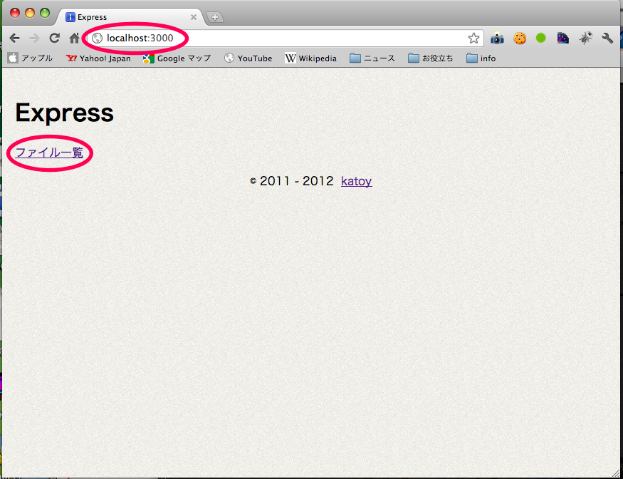
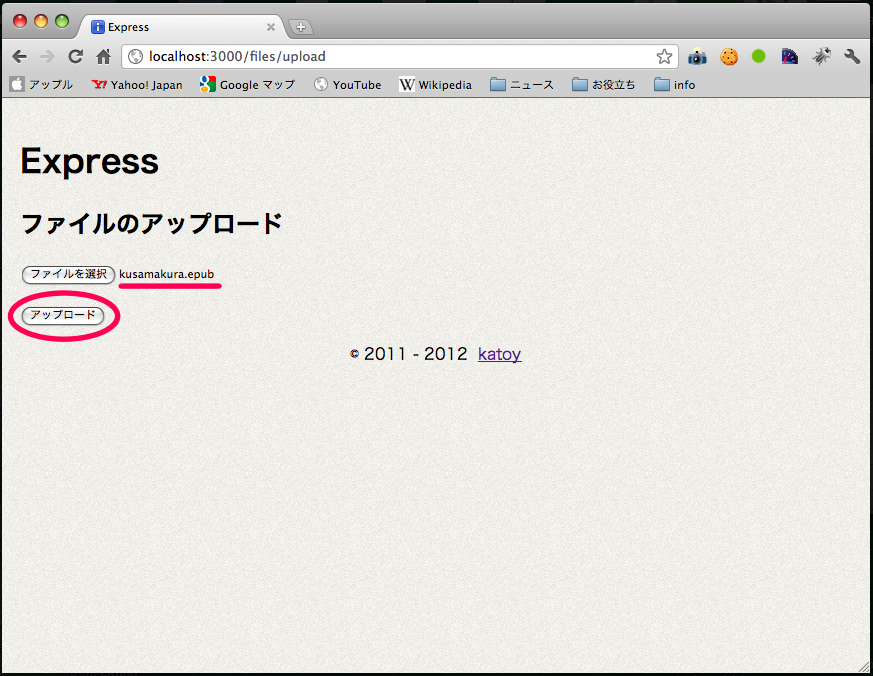
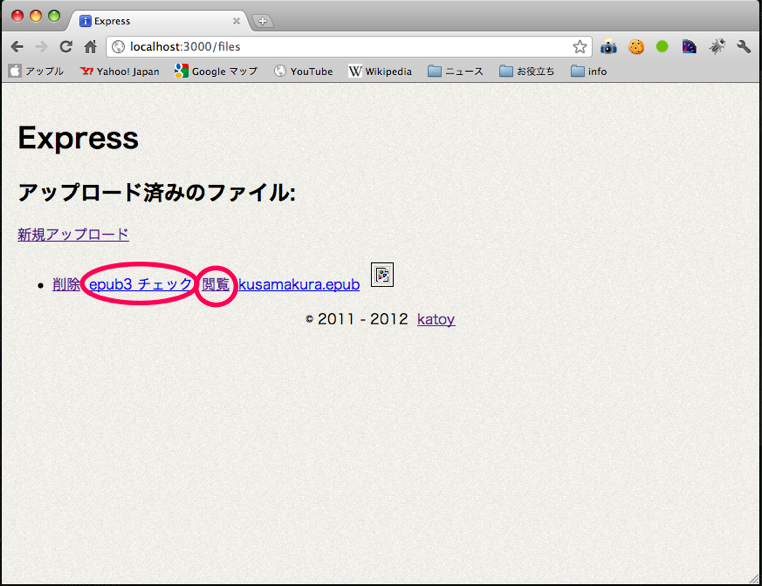
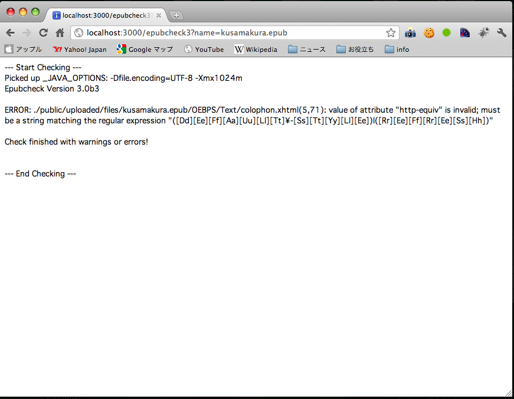

Usage
=====

    $ git clone *********
    $ cd fileupload
    
    $ cake 
    
    $ cake setup clean compile
    
    $ cake run
    or
    $ cake -p=3000 -e=production run
    
    Access http://localhost:3000/

Description
============
express + coffeescript + connect_form で　ファイルのアップロードを実装しています。

TODO
====
- ファイルチューザーで複数ファイルを選択出来るようにする。
- Drag & Drop でもアップロードできるようにする。
- ファイル種類により サムネイル、ファイルアイコンを表示するようにする。

See
====
次の記事を参考にした。

- [File uploads using node.js and express](http://nodetuts.com/tutorials/12-file-uploads-using-nodejs-and-express.html)

- [version for connect-form](https://github.com/jAlpedrinha/nodetuts_ep12)

//--- End of File ---
